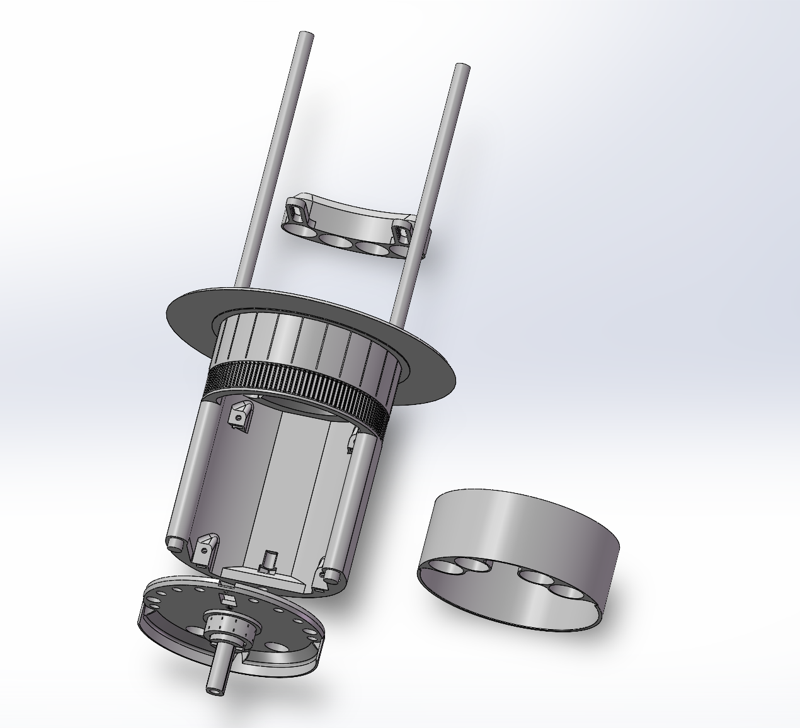
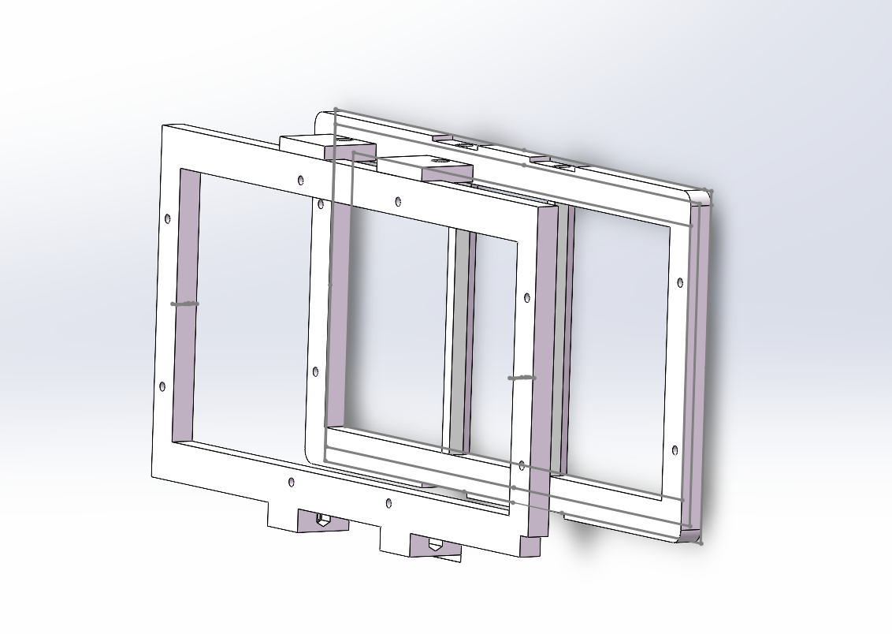
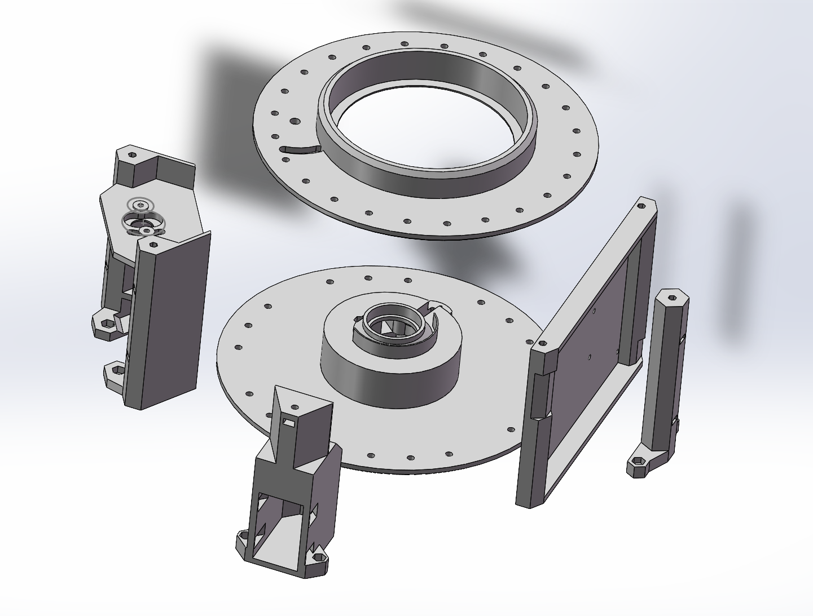

# 3D Volumetric Display — Hardware Design Files

Mechanical CAD and PCB design files for a rotational swept-volume volumetric display based on persistence of vision (POV). Structural components were designed in SolidWorks and fabricated by FDM 3D printing (PLA, with PETG for the motor damper). The custom HUB75E adapter PCB was designed in KiCad.

This repository accompanies the software driver at [LoryVox](https://github.com/LoryZhong/LoryVox).

## Assembly Overview

The mechanical structure is divided into three subsystems:

### Rotate Part — Core Rotating Assembly

The central rotating body that carries all on-rotor electronics. Includes the core (with Raspberry Pi 4 mounting bosses and bearing locators), plug, slip-ring cylinder (sized for the ASL9013 2-line slip ring), bottom bearing ring, GT2 pulley bore, half-disc photo-interrupter flag, and top cover.

- Upper bearing: 6015 deep-groove ball bearing (bore large enough for the Raspberry Pi to pass through during assembly)
- Lower bearing: 6804 deep-groove ball bearing (bore sized for the ASL9013 slip ring)
- Bearings are retained by interference-fit bosses — no adhesive required

**Contents of `rotate-part/`:** Core, plug, slip-ring cylinder, bottom bearing ring, half-disc flag, top cover.

### Frame — LED Panel Mounting Frame

Rectangular frames that hold each HUB75E LED panel (P2.5 64x64) at the correct radial distance from the rotation axis. Carbon-fibre rods (6 mm dia.) connect the frames to the core assembly. Version 2 redesigned the rod socket diameter to 6.1 mm with clearance chamfers, allowing post-print finishing with a 6.1 mm drill bit.

**Contents of `frame/`:** LED panel frame (Version 2), rod socket geometry.

### Support Part — Stationary Base and Motor Mount

The non-rotating platform that houses the power supply, motor, brush holder (AS-PL ABH6004S), and photo-interrupter sensor. Includes the sliding motor-mount bracket for GT2 belt tension adjustment and the PETG motor damper for vibration attenuation.

**Contents of `support-part/`:** Stationary base, motor mount (sliding slot), motor damper (PETG), partial enclosure panels.

### PCB — Custom HUB75E Adapter Board

KiCad project for the 3.3 V-to-5 V level-shifting adapter between the Raspberry Pi 4 GPIO header and two HUB75E LED panel connectors. Uses three 74HCT245 octal bus transceivers (SOIC-20) with per-IC 100 nF decoupling capacitors. Includes a JST-XH 3-pin socket for the photo-interrupter and a JST-XH 2-pin socket for DC-DC power input.

**Contents of `pcb/`:** KiCad project (`.kicad_pro`, `.kicad_sch`, `.kicad_pcb`), BOM (`.csv`), schematic PDF, fabrication Gerbers (`.zip`).

| PCB Parameter | Value |
|---------------|-------|
| Layers | 2 |
| Substrate | FR-4, 0.8 mm |
| Copper | 1 oz |
| Min trace | 0.33 mm |
| Via drill/ring | 0.4/1.1 mm |
| Finish | HASL lead-free |

## Printing Notes

| Parameter | Value |
|-----------|-------|
| Material | PLA (structural parts), PETG (motor damper) |
| Layer height | 0.2 mm |
| Infill | 20–40% (structural), 100% (bearing bosses) |
| Fasteners | M4 hex-socket screws throughout |

## License

MIT
